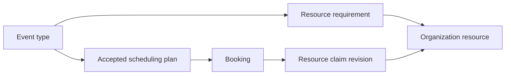

# Resource scheduling: proposed architecture

**Status: R1 allocation foundation implemented; resource rollout remains inactive.**
Original repository archaeology against validated/public Slice 7,
commit `6b2796e05f1ff2bdea13c6bddee04c49e07e6879`, tree
`e87a2e067395c717f2301faf07efd36448f98c2f`, inspected 2026-10-03.
The public Slice 7 branch is `feature/promotions`; PR #1 is not merged. The
architecture baseline on `feature/payment-routing` is `b30941e`. The R1 checkpoint
at the end identifies the local allocation foundation; no Resource UI, live service
activation, runtime configuration change or production migration/deployment occurs.

[BUSINESS-RULES.md](BUSINESS-RULES.md) remains business-policy authority.
[PRICING-ARCHITECTURE.md](PRICING-ARCHITECTURE.md),
[PAYMENTS-ARCHITECTURE.md](PAYMENTS-ARCHITECTURE.md), and
[APPOINTMENT-PROMOTIONS.md](APPOINTMENT-PROMOTIONS.md) describe the financial
contracts this proposal must preserve. The scheduling background also includes
[ARCHITECTURE.md](ARCHITECTURE.md), [DECISIONS.md](DECISIONS.md),
[FEATURES.md](FEATURES.md), [ROADMAP.md](ROADMAP.md), [TASKS.md](TASKS.md),
[PROGRESS.md](PROGRESS.md), [AI.md](AI.md), and the calendar sections of
[INTEGRATIONS.md](INTEGRATIONS.md). Broad roadmap claims are not stronger than
actual code: several describe intended parity or pre-financial-slice behavior.

Names under **proposed** describe the rollout design; the R1 checkpoint lists which
tables/functions are now implemented.
Repository paths and function names under **current** refer to inspected code;
line references describe the baseline and will move during implementation.

## 1. Recommendation and first supported boundary

Keep people and external calendars in the existing host domain. Add generic
organization resources with fixed event-type requirements and durable booking
claims. Do not make equipment users, convert people into equipment resources,
or use group attendee capacity to represent equipment capacity.

Separate administrative ownership from whether a person's time is required.
Keep the existing owner/contact identity and add an explicit `requiresHost`
policy, copied to the accepted booking. A service can therefore be owned by
Kimberly without consuming Kimberly's time. No nullable-host rewrite is needed
for the first version; the meaning of `host_id` on these new resource-only rows
must be made explicit in serializers, calendar logic, and UI.

The first implementation should support individual services, one occurrence,
`maxAttendees = 1`, zero/one/multiple fixed required resources, integer resource
capacity and required quantity, and either one required owner-host or no required
host. Host-free services require at least one resource and an explicit schedule.
Resource-enabled group, collective, round-robin, and recurring creation should
fail closed initially, at configuration and booking boundaries. Existing ordinary
team/group behavior remains its existing domain; it gains no resource bypass.

This supports PEMF Mat without Kimberly, and LumiCeutical Light plus Kimberly
and her conflict-checked external calendars. Broader team allocation can follow
when all required people have authoritative occupancy, not just a primary host.

## 2. Current scheduling schema and enforcement

| Existing structure | Actual role |
| --- | --- |
| `event_types` (`packages/db/src/schema/scheduling.ts:168`) | Organization, individual `owner_id` or team ownership, optional `schedule_id`, scheduling type, duration/options, buffers, gap, notice/window, caps, group seats, recurrence, approval and pricing configuration. |
| `schedules`, `availability_rules`, `date_overrides` | User-owned schedule, IANA timezone, weekly wall-clock windows and date overrides. There is no organization business-hours or resource schedule table. |
| `event_type_hosts`, `team_members`, `team_rules` (`schema/team.ts`) | Team host candidates/priority, public/internal bookability, holidays and no-meeting rules. Team ID integrity on event types is application-managed. |
| `bookings` (`schema/booking.ts`) | One occurrence, organization/service, mandatory primary `host_id`, actual UTC start/end, status, group/override flags, UID/recurrence UID and settlement. |
| `booking_hosts` | Explicit collective/internal co-host associations. No occupied interval or exclusion constraint exists on this table. |
| `booking_attendees`, `booking_references` | Invitees and provider event references. An attendee email is not a person/resource allocation. |
| `calendar_connections`, `calendars`, `busy_blocks` | External connection, selected conflict calendars and cached UTC busy intervals. `calendar_events` stores full provider event data. |
| `time_blocks`, `out_of_office_periods`, user preferences | Personal/focus/travel/preparation blocks, days off, lunch and adaptive meeting limits. |

The current authoritative person constraints are:

- `bookings_host_slot_active_idx`: partial unique `(host_id, starts_at)`.
- `bookings_no_overlap`: GiST exclusion on equal `host_id` and overlapping
  `tstzrange(starts_at, ends_at)`. The final definition is migration
  `0060_vengeful_mongu.sql:8`, superseding 0019/0024/0048.
- Both apply only to `status IN ('confirmed','pending')`, `is_group = false`,
  and `allow_overlap = false`. They guard raw appointment time, not buffers,
  minimum gaps, external calendars, co-hosts, or resource capacity.

The `btree_gist` extension was introduced in migration 0019. Range boundaries
are half open by default. Two raw appointments meeting exactly at an end/start
boundary do not violate the exclusion.

## 3. Current availability and calendar behavior

`packages/core/src/availability/engine.ts:computeAvailability` is pure:
resolve weekly/date windows in the schedule timezone with Luxon wall-clock math;
step through the slot grid; honor duration, notice, offset and booking window;
reject candidate intervals padded by the requested service's before/after
buffers when they overlap supplied busy intervals. Appointment duration must fit
inside a working window; the buffers are not separately required to fit inside
that window. `intersectAvailability` matches hosts' slots by start instant.

`apps/web/lib/booking/availability.ts` adapts persistence:

1. `hostSlots:164` reads an explicit schedule or the person's default schedule,
   calendar connections and conflict-enabled calendar IDs.
2. It combines cached external busy rows, the primary host's pending/confirmed
   bookings, time blocks, lunch, out-of-office and team rules. Own bookings are
   padded by the **candidate service's** `minimumGapMinutes`.
3. Adaptive daily limits can hide slots. This helper reads through `getDb()`,
   not a caller-supplied transaction; do not mistake a call inside another
   transaction for a transaction-consistent availability read.
4. `eventTypeHostSlots:547` uses the owner for individual services; team services
   use `event_type_hosts`, public-bookability filtering and optional collective
   member selection. Group services ignore their own group bookings as busy
   and filter confirmed seat counts at each exact start.
5. `combineHostSlots:137` uses one owner's slots, collective intersection, or
   round-robin union. `getEventTypeAvailability:601` is the common event API.

`bookingsFor:366` reads only `bookings.host_id`, not `booking_hosts`. Consequently,
a co-host association alone does not block that person's booking availability.
`teamSchedule` also reads primary confirmed bookings and cached busy intervals;
it omits pending/co-host bookings and time blocks. A provider invite may later
produce cached busy time, but that is neither immediate nor database authority.

`apps/worker/src/workers/sync.ts:syncCalendar` updates `calendar_events` and
`busy_blocks`; it does not move/cancel corresponding DayOtter bookings. Provider
webhooks enqueue sync; they are not synchronous booking locks. Calendar event
writes/updates/deletes in `lib/calendar/host-calendar.ts` occur after booking
commit and are best effort. There is no transaction spanning PostgreSQL and
Google/Microsoft/CalDAV. Required-host availability must continue checking this
cache, with its existing freshness limitation explicitly retained.

## 4. Complete booking and change-path inventory

These are the discovered application writers, including indirect entry points.
Searching booking INSERT/UPDATE/DELETE calls across web, worker and packages
found four creation writers: `create-booking`, `host-booking`,
`internal-team-booking`, and recurring expansion in `finalize-booking`.
There is no separate guest/customer resource allocator hidden behind the UI.

### Creation and fulfillment

| Surface/call graph | Availability and actual write | Transaction/retry and present protection |
| --- | --- | --- |
| Public profile/service, team, embed, single-use `/book/[token]` pages → `SlotPicker` → `POST /api/book` | Common public availability endpoint; `createBooking` rechecks `eventTypeHostSlots` outside its write transaction. Only `create-booking.ts:660` inserts the first booking. | Booking, attendees, quote, settlement, coupon/credit use and link consumption commit in one transaction. Host uniqueness/exclusion is final protection; advisory cap/group locks add application rules. |
| Authenticated customer booking | Same `/api/book` and writer. Session-derived user ID enables coupon/prepaid access; pricing preview is advisory. | Stable operation/financial claims converge on prior cash, credit or $0 results. No separate authenticated scheduling writer. |
| Guest booking | Same public flow and writer, cash/$0 only. | Guest email does not authorize coupons or credit. Same host constraints. |
| Free/$0 booking, including 100% discounts | `prepareAppointmentAttempt` returns no attempt when due-now is zero; then `createBooking` revalidates and quotes inside its transaction. | `zero_cash` settlement claim and advisory operation lock provide response-loss replay. Approval may leave the booking pending. |
| Package-credit appointment | `/api/book` → verified owner → `createBooking` → `redeemBookingCredit`. Same outside-transaction availability. | Booking, quote, credit redemption and any scheduling allocation must be atomic. Retry returns the original booking before checking today's configuration. |
| Positive cash/deposit checkout preparation | `/api/book` → `prepareAppointmentAttempt:45` → `appointmentCheckout`. Preparation currently quotes/resolves duration; it does **not** call host availability or insert a booking. | Financial attempt and coupon reservation precede Stripe. No appointment/resource slot hold exists. Non-coupon preparation uses repeatable read; coupon preparation uses read committed. |
| Paid browser return, Stripe webhook/inbox processing, polling and recovery CLI | `fulfillCheckout`/`reconcileSession`/`processAppointmentEvent`/`recoverAppointmentPayments` → `fulfillObservedPayment:110` → `createBooking` with saved quote/input/duration. | Payment success observation commits independently; booking transaction locks the attempt and binds one booking. Scheduling conflicts become an owed paid obligation in `requires_review`, not successful booking or refund. |
| Legacy Redis Checkout compatibility | `fulfill.ts:fulfillCheckout` retrieves legacy input with `claimPendingBooking`, then calls `createBooking` with payment. | Same booking writer/host constraints; older destructive-claim/refund crash limitations remain. Resource integration must not exempt this path. |
| API-key creation `POST /api/v1/bookings` | Owner-scoped event lookup → `createBooking`; same scheduling checks. | Stable optional `checkoutRequestId`; positive collection rejected because no API payment workflow exists. API key is a staff/caller identity, not authenticated coupon customer identity. |
| Staff/AI confirmed service or Personal creation | Web/mobile `/api/ai/schedule/create`, rich Otter confirmation and SMS confirmation → `createOtterEvent` → `createHostBooking:90`, INSERT at 145. | Staff intentionally skips public availability, accepts explicit start/end and relies on person constraints. Service quote/attendees commit together; positive cash unsupported. No durable request-id contract for ad-hoc staff creation. |
| Internal team creation | `/api/teams/[id]/internal-booking` → `createInternalTeamBooking:92`, INSERT at 138. Conflict preview uses `teamSchedule`; organizer may knowingly override people. | Booking/hosts/guests commit together with `allow_overlap=true`; hidden Personal service is explicitly noncommercial. No authoritative co-host exclusion or operation deduplication. |
| Public free recurring expansion | `finalizeConfirmedBooking:50` → nested `finalizeOccurrence:265`, INSERT at 287. Also reached after pending approval. | Each occurrence has its own transaction and zero-cash quote, but no ordinary availability recheck. Errors skip occurrences; remaining occurrences run four at a time after first commit. Whole series is not atomic or durably deduplicated by occurrence index. |
| Staff recurring/batch creation | `createOtterEvent:43` loops `seriesOccurrences` through `createHostBooking`. | Independent transactions; an error can leave a partial series. No all-series availability transaction or replay identity. Focus/reminder kinds write time blocks, not bookings. |

The voice receptionist only sends a booking link. Routing forms and the public
booking assistant guide the caller to services/slots; they do not INSERT bookings.
`finalizePoll` (`lib/polls/polls.ts`) marks a poll finalized and creates a provider
calendar event, explicitly **without** a booking row. Polls, direct provider
invite actions, time blocks and sync cannot be treated as resource reservations;
resource-bearing services must never be fulfilled through those mechanisms.
Plugin lifecycle hooks run after commit; no dedicated plugin booking writer was
found. Future plugin/database writers must satisfy the same database guards.

### Changes, allocation release, and incidental writes

| Path | Actual mutation and present boundary | Required resource integration |
| --- | --- | --- |
| Capability-UID reschedule route; booking page/widget; mobile; Otter tool `reschedule_booking`/`shift_bookings`; confirmed SMS move | `rescheduleBooking:34` reads booking/service, checks only fixed primary host outside the transaction, then locks booking and UPDATEs start/end at 188. Actual duration and financial lineage persist. | Atomically move all claims with the row; check fixed original resource plan. Batch shifts are independent moves, not a series transaction. |
| Capability cancellation route/UI/mobile/SMS/Otter | `cancelBookingWithResult` → `decideBookingCancellation:50`; attempt → booking locks, status change at 88, credit/coupon restoration and durable cash refund obligation in the transaction. | Release all claims within that decision transaction, before external refund/calendar cleanup. |
| Series cancellation | `cancelBookingSeries:204` selects this and later occurrences, calls ordinary cancellation serially, including already-cancelled rows for refund recovery. | Idempotent per occurrence. Do not claim atomic whole-series cancellation. |
| Host confirmation `/api/bookings/[uid]/confirm` | `approveBooking:37` conditionally flips pending → confirmed at 74, then runs full finalizer. Group seat count is outside that conditional UPDATE. | Pending already owns claims; approval does not acquire again. Validate allocation completeness in the approval transaction. |
| Host decline `/api/bookings/[uid]/decline` | `declineBooking:109` conditionally sets rejected at 124, then emails. | Add an explicit transaction for rejection + resource release. Financial decline policy remains the existing separate business boundary. |
| No-show and undo | `/api/bookings/[uid]/no-show` directly changes status to no_show or confirmed/completed; host-only, but allows future rows and does not exclude rejected rows. | Do not release resource time on no-show. Reject inappropriate resurrection of released allocations, or require explicit authoritative reacquisition. |
| Worker completion | `maintenance.ts:markPastBookingsCompleted` changes confirmed to completed once raw end is past. | Retain finite claim through its buffered end; completion must not release cleanup time early. |
| AI edit booking | `ai/tools/exec.ts:837` changes title/description/location and attendees, not occupied time; writes are not one shared transaction. | No reallocation for these edits; resource/service identity and interval fields cannot become generic editable inputs. |
| Calendar/meeting URL and settlement writes | Finalizers, host/reschedule helpers, credit/redemption and refunds update meeting URL or payment fields. | No resource consumption/restoration from metadata or payment-status updates. |
| Account deletion | `packages/auth/src/index.ts:beforeDelete` directly deletes primary-host bookings; existing financial FKs already restrict many deletions. | Restrict deletion of managed bookings/resources with claim history. Use cancellation/archive; no cascade that erases allocation evidence. |

There is no booking reassignment endpoint in the discovered writers. Changes to
booking host/service/organization, raw SQL administrative changes and newly added
writers must fail database integrity checks rather than silently detach claims.

## 5. The Light & Balance concurrency problem

Two event types owned by Kimberly still resolve her as primary host. Light
Therapy 10:00–11:00 and PEMF 10:00–11:00 therefore compete for the same host
slot: the second booking is rejected even when equipment differs. Giving each
service a fake user would misrepresent identity, schedules, calendars, permissions
and payment routing.

Proposed examples, assuming resource capacity one and zero buffers:

| Service | Required person | Required resource | Result |
| --- | --- | --- | --- |
| PEMF 10:00–11:00 | None | PEMF Mat ×1 | Can coexist with Light Therapy. |
| Light Therapy 10:00–11:00 | Kimberly, when configured | LumiCeutical Light ×1 | Requires both light capacity and Kimberly's cached availability/person slot. |
| Light Therapy 10:30–11:30 | Same configured host policy | LumiCeutical Light ×1 | Conflicts with the first Light Therapy regardless of host choice or staff override. |

If both services actually require Kimberly, they should conflict even though the
resources differ. A resource must not erase a real person's required attendance.

## 6. Proposed durable model

Three new tables, plus narrow scheduling-policy fields on existing rows:

### Resource: `resources`

- UUID identity, organization ID, understandable name, positive integer capacity,
  enabled flag, timestamps. Names may change; identity/organization may not.
- A bigint `allocation_version` used as a transactional serialization fence,
  **not** a mutable usage counter. Capacity comes from interval claims.
- Unique `(id, organization_id)` for composite references. No serial numbers,
  purchases, stock counts, maintenance, depreciation or asset accounting.
- Disabled resources keep existing bookings and history. First-version resource
  deletion is prohibited; archive instead. This also preserves references from
  immutable attempt/booking plans, whose resource lists are JSON rather than FKs.

### Resource Requirement: `event_type_resource_requirements`

- Organization, event type, resource, positive integer `quantity` default one.
- Unique `(event_type_id, resource_id)`; duplicate selections cannot inflate or
  obscure demand. `quantity <= resource.capacity` validated under resource lock.
- Composite FKs to `(event_types.id, organization_id)` and
  `(resources.id, organization_id)`. Configuration is mutable, accepted plans are
  not. A claim must not depend on a deletable requirement row for its history.
- Quantities cost one integer and weighted capacity math; support them from the
  start. The UI can initially default to one without inventing inventory.

### Accepted scheduling plan: booking and attempt fields

Add a versioned, server-generated immutable plan. Preserve organization/service
identity, configuration revision and admission epoch; accepted resource IDs,
quantities and copied names; required-host policy and actual fixed host IDs;
resolved schedule identity and schedule timezone; organization business timezone
as historical context; actual resolved duration; before/after buffers and the
required-person minimum gap. Schedule/business/customer display zones are distinct.
Requirement rows are current configuration, never historical pricing/scheduling
truth. Resource rename/disable and requirement deletion cannot rewrite acceptance.

Keep appointment UTC start/end and allocation revision on the booking. Claims
preserve the exact derived occupied interval, capacity-at-allocation, allocation
actor/time, predecessor and one-way release provenance. A move keeps actual
duration and accepted resource/host/buffer terms and appends allocation history.
A proven empty list means accepted absence of resources; null means unknown.
Neither permits future admission onto a currently resource-enabled service
without the proof/adoption rules in section 7.

- `event_types.requires_host` defaults true. Keep ownership/contact/merchant
  identity separate; host-free services require a validated explicit service
  schedule and at least one fixed resource. Opening hours do not belong to
  Resources themselves in v1 (section 10).
- Copy `requires_host` and fixed required host IDs to bookings. Host-free mode
  has an empty required-person set. Change host exclusion/unique predicates to
  require this flag; `allow_overlap` remains an existing person override only.
- Supported resource-enabled individual services have their fixed owner-host,
  or no host, resolved before checkout. Resource-free team attempts retain
  existing selection policy; record actual hosts at booking creation. Do not
  freeze an unrelated round-robin host before checkout.
- Save immutable scheduling terms on positive-cash attempts before Stripe, bound
  separately/versionedly from the existing financial quote/hash. Finalization
  context carries the same custody and allocation revision. Neither acceptance
  nor adoption changes financial quote/payment/coupon/package history.
- Direct free/credit/staff acceptance captures terms under service `FOR SHARE`
  in the booking transaction. Paid fulfillment uses its locked attempt's terms,
  then passes the current service-admission gate. An old empty/unknown checkout
  plan is not grandfathered past resource activation.
- A restricted, reviewed adoption operation may append a new scheduling acceptance
  for an existing legacy/empty-plan booking. Retain the old plan (including null),
  proof, actor, operation identity and reason as history; never overwrite it or
  pretend equipment was used before adoption. Ordinary writers cannot perform
  this transition. Section 7 specifies its authority and admission.

### Resource Claim: `booking_resource_claims`

- Identity, organization, service, booking, resource, scheduling revision,
  positive quantity, resource name/capacity copied at allocation, occupied UTC
  start/end, allocation timestamp and optional actor/source.
- One row per resource per booking revision; quantity consumes that many units
  throughout the interval. No individual equipment units are assigned.
- Release timestamp and reason (`cancelled`, `rejected`, `rescheduled`) plus
  predecessor reference for a replacement claim. Original interval/quantity/scope
  are immutable. A move appends new rows; it does not erase old intervals.
- Unique `(booking_id, resource_id, revision)` and a partial unique active
  `(booking_id, resource_id)` where release timestamp is null. Checks enforce
  finite ordered interval, integer bounds and legal one-way release transitions.
- Composite booking FK `(booking_id, organization_id, event_type_id)` uses the
  existing `bookings_id_org_event_idx`; composite resource FK enforces organization.
  Restrict parent/direct history deletion. Index unreleased ranges per resource
  (GiST with btree_gist is useful for overlap reads, not the capacity invariant).

Pending and confirmed bookings own unreleased claims. Completed/no-show bookings
retain their finite claims, including after-buffer time; expired intervals do not
occupy unrelated future times. Cancellation/rejection explicitly release them.
This avoids the maintenance worker freeing equipment as soon as raw end passes.
A cancellation retry does not create a new reverse allocation or restore capacity
through a counter: it finds already released claims and makes no change.

## 7. PostgreSQL authority: serialize, then check peak demand

**Recommended:** lock/fence resource rows and check aggregate interval demand in
PostgreSQL. Application availability is a prediction. The database enforces both
capacity and the completeness of booking allocation at transaction commit.

For the complete required resource set, lock resource IDs in ascending UUID
order using `FOR NO KEY UPDATE`, then increment each `allocation_version` in
that order. Every claim insert/release/replacement and capacity/configuration
mutation uses this boundary. All locks are retained until commit/rollback.
Acquire the complete set first, not one resource followed by a later discovery
of another. No Node lock, Redis semaphore or distributed lease is involved.

At READ COMMITTED, capacity reads are a **subsequent SQL statement after** the
fence/lock. Trigger/functions doing this work must be VOLATILE and use fresh
queries, not a STABLE function, previously materialized CTE, or pre-lock count.
The real row update also makes an older repeatable-read/serializable snapshot
fail with a serialization conflict when another allocation changed that resource;
a plain lock without a write would not by itself refresh such a snapshot.
Bounded retries repeat only the whole database transaction, never Stripe calls
or provider effects. Each fence update is rolled back with its transaction.

These isolation and lock facts come from PostgreSQL 17's
[explicit locking](https://www.postgresql.org/docs/17/explicit-locking.html),
[transaction isolation](https://www.postgresql.org/docs/17/transaction-iso.html),
and [function volatility](https://www.postgresql.org/docs/17/xfunc-volatility.html)
references. The allocation strategy and policy below are this proposal, not a
claim that PostgreSQL provides a built-in aggregate-capacity constraint.

### Exact capacity calculation

For candidate `[a,b)` requiring quantity `q`, select every unreleased claim for
that resource with `claim.start < b AND claim.end > a`. Clip each to `[a,b)`.
Create endpoint deltas `+quantity` at clipped start and `-quantity` at clipped
end. Group deltas sharing an instant, sort ascending, and compute cumulative
load. With no existing demand the peak is zero. Admit only if
`peak + q <= locked capacity`, with positive `q` also checked against that capacity.

Grouping equal instants implements end-exclusive semantics: one claim ending at
10:30 and another starting at 10:30 do not consume an extra simultaneous unit.
For a move, exclude only that booking's old active claim, under its row lock;
never exclude arbitrary IDs supplied by a client. The admission check covers
**every point in the interval**, not only the appointment start.

Do not sum the quantities of all overlapping rows. At capacity two, existing
A 10:00–10:30 and B 10:30–11:00 leave capacity for C 10:00–11:00; summing A+B+C
would wrongly reject it. Endpoint peak math admits C. Three fully simultaneous
quantity-one bookings at capacity two admit exactly two. Quantity two consumes
two throughout its interval. This is also the pure predicate used in prediction.

### Database guards and allocation completeness

CHECK constraints and FKs validate local values/references; they cannot prove
cross-table allocation completeness. Use deferred constraint triggers on BOTH
booking-side mutations and claim-side INSERT/UPDATE/DELETE (or an equivalently
strong database mechanism). Re-read final booking/revision state at commit,
not the intermediate `NEW` row captured before later statements.

The invariant is:

`occupied managed booking revision → proven immutable accepted scheduling plan
→ exactly the required unreleased claims → exact quantities, organization,
service, resource identity, revision and derived occupied interval → no extras`.

Pending/confirmed consume current active claims. Completed/no-show retain finite
claims, including cleanup buffers, even after raw end. Cancelled/rejected retain
accepted terms and released historical claims but have no active claims. Old
released move revisions remain legitimate history. No metadata/status shortcut
may resurrect a released allocation, detach scope or erase history.

Immediate guards protect accepted-plan/history identity, scope, legal one-way
release/replacement transitions and resource fencing. New claim identity, quantity,
configuration/allocation revision, copied facts and derived interval must match the
accepted plan BEFORE disabled/capacity diagnostics. Malformed claims are invariant
failures regardless of unrelated occupancy. Release updates retain their original
revision/interval during a legal replacement; they do not have to match the new
interval before replacement claims exist. Capacity guards serialize
claim inserts/releases/moves and resource changes; insertion checks demand before
adding its quantity, or excludes its own row in an after-write check. Deferred
completeness catches omitted/extra claims and interval updates without replacement.
After resource acquisition, validation reads already proven immutable custody and
final state: no new competing service/booking/financial locks are taken there.

A new plan must match locked current configuration or the same booking's locked
accepted attempt. An explicit empty list, supplied `requires_host=false`, copied
revision number, boolean or session setting proves nothing. Attempt linkage must
also satisfy existing financial/input/owner binding. New raw INSERTs and all
future-occupancy changes are guarded; a check only on new INSERT is insufficient.
Tests must deliberately omit/forge allocations through direct SQL. Existing
financial deferred guards in 0063–0069 remain in force.

### Service admission and activation: every future occupancy

Add a durable service admission epoch/revision on `event_types`, changed only by
the guarded configuration operation. The resource-enabled policy is a DATABASE
admission boundary, not a UI flag or a grandfather exemption for old records.
All new/future interval or occupied-status admissions acquire the service row
explicitly `FOR SHARE`, verify the current epoch/policy, and hold that lock through
commit. This includes direct/API/staff creation, accepted checkout preparation,
paid fulfillment/binding, moves, historical rows moved into the future,
approval/resurrection and recurring/finalization INSERT paths. Ordinary new rows
need a proven plan even if resource-free. Managed services must be active for new
admission; the existing hidden Personal noncommercial exception has no resources
and explicit custody, rather than a general inactive-service bypass. An idempotent
return of an already committed booking creates no new occupancy.

Activation, service active/inactive changes, and requirement/policy edits take
that SAME service row `FOR UPDATE`, explicitly, before inspection/mutation, and
retain it through commit. An ordinary non-key UPDATE typically holds only
`FOR NO KEY UPDATE`, which coexists with FK key-share locks: that is insufficient
as the activation boundary. `FOR UPDATE` conflicts with both participating
`FOR SHARE` admissions and FK key-share locks. Supported paths take the explicit
share lock BEFORE writing or locking an existing booking; database mutation guards
also enforce participation against raw writes. Raw SQL with different lock order
may abort, never bypass admission.

Activation runs at READ COMMITTED. After obtaining `FOR UPDATE`, run ONE subsequent
commitment census statement (a UNION/CTE in one snapshot) covering:

- All remaining booking occupancy, including pending/confirmed, future/ongoing
  completed/no-show intervals and buffered claims. Legacy bounds that cannot be
  proven elapsed are included conservatively for review, never assumed to have
  zero buffers. Completely elapsed history can remain resource-unknown.
- All accepted/unfulfilled attempts, including prepared/open, verified paid,
  fulfilling and review obligations, even with frozen explicit empty plans.
  Local expiry timestamps alone do not exclude an attempt; require verified
  terminal/no-payment evidence or durable completed resolution. Include bound
  attempts through their booking branch and preserve their reference in results.

Capture one inspection instant after the lock. Classify/deduplicate references
in this coherent census; do not query future bookings, then separately query
attempts. Preparing attempts and any transition entering/leaving the blocking
commitment set also hold service `FOR SHARE`. Fulfillment's attempt→booking
transfer and binding are one transaction under that share lock. Consequently the
exclusive inspector sees either the pre-commit attempt or post-commit booking,
never the gap between two snapshots, and no admission can cross during inspection.
Activation reads attempts/bookings without locking their rows: taking those locks
while holding the exclusive service lock would invert attempt→service admission.

Refuse activation until every incompatible ongoing/future commitment is drained,
resolved or safely adopted. Enabling resources or inactive→active cannot waive
this census. Requirement edits on an already managed service preserve proven
nonempty historical plans, while transition from resource-free to resource-enabled
must reconcile empty plans again. Removing requirements does not erase the epoch
or old claims. The gate remains active for all later interval/status admissions.

In particular, a legacy/null or accepted EMPTY-plan booking MUST NOT move into
future occupancy on a currently resource-enabled service without explicit reviewed
adoption. This remains true if the original booking was entirely historical,
the financial quote is frozen, or a caller uses internal override/recurrence.
Fail closed rather than silently copying today's requirements into history.

### Reviewed adoption authority

Adoption is a narrow privileged operation, not a flag in ordinary create/move.
Use a restricted database function/role and guarded durable provenance on the
booking: stable adoption operation ID, original scheduling plan/hash (or explicit
unknown), prior interval/revision, reviewed destination, newly accepted service
terms/epoch, approver/actor/time and review reason. Ordinary application DML may
neither manufacture adoption provenance nor rewrite accepted terms; enforce
privileges/immutable transition guards, not `SET LOCAL adopted=true` or a caller
boolean. Retry of that operation returns its original evidence/result.

The function takes the same attempt→service→person/cap→booking/host admission→
financial→resource order, validates organization and existing financial lineage,
and allocates the entire reviewed destination atomically. For a historical booking,
claims begin at the reviewed new interval; prior resource use stays unknown.
For an ongoing/future adoption, prove current capacity/buffers/host policy and
retain consent/operational review. Unsafe capacity, unsupported recurrence, lost
schedule or ambiguous terms fail closed. Refund/restored-credit/coupon history
cannot be resurrected by adoption; require an expressly supported financial
workflow, never reconstruct unknown settlement. Normal reschedule never adopts
implicitly.

For initial activation, prefer a drained/empty commitment boundary. If existing
future bookings must be adopted beforehand, persist an approved, immutable staged
activation configuration/revision on the service and quiesce admissions for that
service. Restricted adoption validates against that exact staged revision; it
cannot use an arbitrary requested resource set. Normal readers/writers do not
activate staged policy. The final exclusive census verifies every adoption and
activates the SAME staged revision; edits invalidate readiness. If this facility
is absent, activation with those bookings simply remains blocked until drained.
After activation, historical-to-future adoption uses the live locked revision.
An activation census may accept already committed reviewed adoption evidence;
activation does not acquire competing booking/attempt locks to perform adoption.

### Why this mechanism

A single exclusion constraint can protect capacity one; it cannot enforce an
arbitrary SUM of concurrent quantities. Internal capacity lanes/units plus one
exclusion per lane are viable, but add assignments and can reject a feasible
pooled interval when previous assignments are fragmented across lanes. Repacking
would introduce extra work. Physical serial-number units are unnecessary here.

Resource row serialization plus exact peak math uses three tables, supports
quantities and pooled capacity without fragmentation, and makes reductions and
multi-resource allocation use the same rule. Contention is per resource; disjoint
Light/PEMF allocations do not share a resource lock. Keep transactions short and
index range reads. A reservation counter or check-then-insert without these
database guards is insufficient.

## 8. Global lock order and atomic multiple-resource acquisition

Sorted resource UUIDs prevent resource→resource inversions, NOT every deadlock.
Host uniqueness/GiST admission can wait on another uncommitted booking without
an explicit application row lock. All competing host-index work must occur
BEFORE acquiring resources.

Supported order, taking only the categories needed by the operation:

1. Stable operation-identity advisory locks; existing payment attempt rows
   `FOR UPDATE` (sorted IDs for a true batch); service admission/configuration
   `FOR SHARE` for acceptance or `FOR UPDATE` for management, sorted service IDs;
   then person-admission mutexes sorted by user ID, followed by the complete cap
   key union sorted lexically. All these sets precede booking/host-index work.
   Existing cash paths retain attempt-before-booking. Service captures precede
   booking/claim writes. Activation never waits for attempt/booking rows.
2. Existing booking rows `FOR UPDATE` in stable ID order; booking INSERT or a
   tentative interval/status UPDATE so primary-host unique/GiST admission runs.
   Validate supported status, revision, actual duration, and caps/person gaps.
3. Competing financial/link mutations BEFORE resources: stable settlement claim,
   coupon definition/use, entitlement/redemption/restoration, refund operation,
   limited booking link, pricing/attendee/host associations as applicable. Cash,
   package and $0 are exclusive, so no path may mix their financial branches.
4. Acquire the COMPLETE resource union in ascending UUID order using
   `FOR NO KEY UPDATE`, increment fences, perform fresh capacity reads and mutate
   claims. No new competing host-index, person/cap, service, booking, attempt,
   coupon, credit, link or refund lock after this point.
5. Deferred checks re-read final state without new competing locks, then commit.
   Binding an already locked attempt/booking may reuse its locks; no provider I/O.

Actual financial ordering inspected: `decideBookingCancellation` locks attempt,
booking, restores credit, restores coupon, then prepares refund. Package mutation
SQL in 0067 explicitly locks booking before entitlement; `redeemBookingCredit`
uses an already inserted/locked booking, then entitlement/ledger. Paid coupon
redemption locks the attempt-linked use; cancellation locks the booking-linked
use. Direct $0/checkout reservation locks coupon definition before its new use.
Terminal coupon release takes attempt before use. These exclusive branches must
finish before resources. Cancellation with both historical ledgers follows
credit then coupon then refund; sorted IDs apply if more than one of a category
is involved. Package-purchase work has no booking/resource admission and must
not acquire a booking later while holding an entitlement.

Today's code is not already in this complete order: link consumption precedes
booking INSERT, cap keys differ between create/move, and moves lack an attempt
lock. Refactor those touched transactions during rollout. Refund executor's
operation-only claim/bind transactions finish before its separate completion
transaction takes attempt→booking→refund; do not combine them into operation→
attempt locking. Service/resource management reads booking/attempt obligations
without row locks after taking configuration/resource locks.

For the create-vs-move cycle: create acquires its host-index position before X;
move tentatively UPDATEs time (host-index admission) before X as well. If move
waits on create, it does NOT hold X, so create can finish allocation and commit.
If resource validation then fails, PostgreSQL rollback restores the tentative
time UPDATE and old claims. Do not lock X and then UPDATE occupied booking time.
No resource allocator belongs in a BEFORE-booking INSERT trigger that would
precede financial work. Immediate guards may reuse held locks; later guards must
not perform new competing host-index work.

X+Y versus Y+X both acquire the sorted complete set. If one requirement fails,
rollback booking, claims, quote, link count, credit/coupon changes and attempt
binding. A batch must gather its full service/person/booking/resource union in
advance or remain independent transactions; no incremental reverse acquisition.

Bound retries of the WHOLE database transaction to three attempts for `40P01`
(deadlock) or `40001` (serialization). Unwrap driver causes, release all locks,
use short bounded jitter, reload durable operation results/service epoch and
locked revision, then retry. Never retry only the failed claim statement or
repeat Stripe/provider effects. Exhaustion returns a transient failure; paid
attempts retain success facts and bounded recovery/backoff. Expected resource
conflicts and invariant failures are classified separately (section 11). Raw
SQL and implicit/provider-domain locks mean this is not a deadlock-free claim.

## 9. One resource interval, with buffers

For accepted actual appointment `[start,end)`:

`occupied = [start - acceptedBufferBefore, end + acceptedBufferAfter)`.

Use finite UTC `timestamptz` bounds and half-open overlap in both availability
and SQL authority. Public appointment end is resolved from the allowed duration;
the existing explicit staff override uses its actual start/end. A move retains
the booking's actual duration. Buffer values are captured on acceptance,
so later service edits do not resize earlier allocations.

Resource buffers reserve equipment setup/cleanup using existing event fields.
No resource-specific turnover field is needed initially. `minimumGapMinutes`,
travel blocks, lunch and host prep automation remain person rules; they do not
silently become extra resource minutes. The existing engine's person buffers
remain as inspected; this resource rule also accounts for the **existing claim's**
accepted buffers, unlike today's raw-host exclusion.

With zero buffers, A ending at 11:00 and B starting at 11:00 can coexist. With A's
after buffer of ten minutes, B cannot occupy the same resource before 11:10.
If B also needs a ten-minute before buffer, its appointment cannot begin before
11:20. Do not feed already padded resource claims into `computeAvailability.busy`
and then apply the candidate's buffers again indiscriminately: calculate the
candidate resource interval once and compare it with stored claim intervals.

Retain current working-window semantics: the appointment fits opening hours;
buffers may extend them. Changing this to require all setup/cleanup inside
opening hours would be an explicit later policy change, not implicit allocator math.

## 10. Service schedules, availability and host-free consumers

### V1 opening-hour boundary and strict resolution

V1 does NOT independently schedule Resources. Opening hours belong to the Event
Type/service. Resource peak capacity filters service-generated candidates;
multiple Resources have no separate hours and capacity two has no individual
unit calendars. Later resource-specific hours should reuse/intersect the existing
schedule abstraction, never introduce another scheduling engine.

Resource-only services require an explicit schedule ID. Validate that exact row,
owner/organization authorization and IANA timezone; capture the resolved ID,
owner and timezone in accepted terms. A missing/deleted/unusable ID gives no
availability and fails acceptance/move closed. NEVER silently substitute the
owner's default. Current `schedules/[id]/route.ts:DELETE` permits deletion and
`event_types.schedule_id` uses `ON DELETE SET NULL`, producing default fallback.
Add restrictive deletion guards for schedules referenced by resource-only service
configuration or durable accepted plans. Reassign configuration deliberately;
archive/retain the old schedule while accepted history depends on it. Account
cascade deletion must not bypass that protection. Do not change unrelated
ordinary service fallback behavior as an accidental policy change.

Use existing `computeAvailability` weekly/date overrides and Luxon wall-clock
DST resolution with the service schedule's timezone. Store UTC intervals and
preserve accepted timezone as explanation. Current rules/timezone on the accepted
schedule identity remain live move bookability rules; invalid zones are rejected.
Organization coupon/business timezone and customer display timezone never replace
schedule interpretation. Buffers retain section 9's elapsed UTC interval semantics.

### Prediction and required-person integration

Required-host individual services retain host schedule, cached conflict calendars,
personal blocks, OOO, lunch and notice/window behavior. Host-free services call
the pure engine with explicit service hours/duration/cadence/notice but no owner's
bookings, calendar busy, lunch, focus or meeting limits. Apply resource peak
filtering to every candidate for every requirement, fetching occupied claims across
range edges and candidate buffers. Do not double-pad already buffered claims.

Wire `getEventTypeAvailability`, creation resolver, public/v1 endpoints, SlotPicker,
troubleshooter and AI service recommendations. Authorized booking-scoped move
availability uses accepted terms and excludes ONLY its own claim/known provider
mirror. Public clients cannot submit arbitrary exclusion IDs. A person-only free
slot recommendation is not a promise about resources.

### Cap and gap rollout requirements

For supported services, ordinary creation and move use the same pending+confirmed
counts, exclude the mover itself, and check all configured daily/weekly/monthly/yearly
caps. Approval does not increase a cap already counting pending. Preserve existing
active-status cap semantics; this is not a redesign of retrospective usage totals.
Acquire EVERY applicable intersecting period key, not just a supposedly coarsest
one: ISO weeks cross months/years. Gather source+destination key union for moves
before booking locks, sorted deterministically. Use namespaced service keys
containing organization/event/period/zone/start, and separate person daily-focus
keys. Host-free service caps use the explicit schedule timezone and service ID,
never Kimberly's person key or focus count. Required-host service caps preserve
current host-timezone interpretation; copy its resolved cap zone in acceptance.

Current move passes `gapMinutes=0`, counts only confirmed, omits monthly/yearly,
and uses a different weekly key from create. Those are mandatory narrow fixes
for the supported rollout. Pass the accepted required-person minimum gap in
both create/move prediction. Under a shared per-primary-person admission advisory
mutex BEFORE booking/host-index admission, re-read primary pending/confirmed
commitments (excluding self) and perform the same candidate buffer/gap predicate
inside the transaction. All supported primary-person writers participate, including
resource-free bookings that can compete with them. Staff's existing deliberate
person schedule/cap/gap override remains explicit and recorded; it NEVER bypasses
resources. Direct SQL/raw host exclusion alone still does not prove gap/calendar correctness. Do not claim
resource capacity fixes co-host or synchronous external-calendar enforcement.
Gaps are person constraints, not extra equipment minutes.

### Host-free consumer checklist

Ownership/contact is never proof of required attendance. Use accepted booking
host policy in readers AND worker execution, not mutable current event settings.
Keep organization service appointments visible in a separately labelled operational
view; filter them from personal occupied-time views before limiting/counting rows.

| Actual consumer | Current assumption and required gate |
| --- | --- |
| `apps/web/lib/calendar/agenda.ts:getAgenda` and its AI/calendar callers | Reads non-cancelled bookings by primary `hostId`. Personal agenda/busy/next-meeting must require actual required-person policy; operational contact appointments get separate labels/views. |
| `calendar/invites.ts:listPendingInvites` | Invite conflict detection treats confirmed owner bookings as busy. Exclude contact-only rows, retaining real external invite busy. |
| `calendar/inbox.ts:inboxData` | Double-booking diagnostics compare confirmed owner bookings with opaque external events. Only required-person rows participate. |
| `booking/team-schedule.ts:teamSchedule`, `shared-team-calendar.ts:loadSharedTeamCalendar` and public/embed team views | Shared person calendars must not show resource-only ownership as member busy time. Preserve existing privacy stripping. |
| `apps/worker/src/workers/reminders.ts:startRemindersWorker` | Customer reminders/workflows/followups may run with service/contact copy. Host extra-channel attendance nudges, scribe and overflow require actual attendance; gate at execution even for stale queued jobs. |
| Same worker's overflow branch; `booking/running-late.ts:notifyRunningLate/notifyNextMeetingDelayed` and running-late/notify-next routes | Gate BOTH source booking and NEXT selection by required-person policy before ORDER/LIMIT. An ordinary Kimberly meeting must skip a following PEMF-only booking and select her next actual required meeting. Running-late actions cannot imply contact-only attendance. |
| `workers/morning-briefing.ts:sendDueBriefings`, `team-briefing.ts:sendDueTeamBriefings`, shared `briefing-common.ts` formatting | Filter person meeting lists/counts before finding first/busiest/next; operational resource appointments are not personal workload. Shared formatter does not itself query bookings. |
| `booking/finalize-booking.ts`, `host-booking.ts`, payment finalization/context, `reschedule-booking.ts`, `calendar/host-calendar.ts` | Skip owner's provider writes/conferencing and personal side effects for host-free rows, including stale finalization/retries. Do not create opaque mirrors that re-enter busy cache. Preserve administrative/customer confirmations. |
| `automation/apply-rules.ts:reserveRuleBlocks/applyBookingRules`, travel helpers, cancellation reclaim, weekly automation worker | No owner prep/buffer/travel/focus reclamation triggered by host-free appointment. Weekly blocks remain personal and do not filter resource-only service hours. Customer workflows remain explicitly non-attendance semantics. |
| Person caps, fairness, insights, assistant meeting lists and calendar serializers | Audit all `hostId` readers; exclude contact-only commitments or label them operationally. No implicit co-host/attendee insertion for the owner. |

Resource-only conferencing and separate resource-calendar mirrors remain deferred;
reject incompatible auto-conference configuration for v1 rather than create a
meeting requiring the owner. External calendar cache lag remains an explicit
required-person limitation, not a Resource correctness dependency.

## 11. Booking creation, finalization and database errors

Shared narrow helpers capture/prove scheduling terms, perform service admission,
allocate all resources, move claims and release claims. Pure prediction math stays
in core; persistence stays in booking/payment domains. Use accepted plan in the
pre-transaction resolver too: today's event resolver must not reinterpret frozen
resource/host/buffer terms. Revalidate current admission epoch under the service
share lock before committing future occupancy.

`createBookingOnce` replays durable operation results first, then locks identity/
attempt/service/person/caps, inserts the booking to obtain host-index admission,
finishes quote/attendee/link/financial work, allocates the sorted resource set,
binds already locked attempt/context and commits deferred completeness. Resource
failure rolls back booking, coupon/credit use, $0 claim and link consumption.
Bind the paid attempt inside this SAME transaction after allocation validation;
no successful binding is visible before commit. Ancillary finalization runs afterward.

`createHostBooking` retains explicit staff schedule override for people, not
resource capacity. Real service rows take the same service gate and actual-interval
allocation. Personal has a proven empty plan and cannot acquire resource/host-free
configuration. Stable staff operation identity is required for response-loss replay;
capacity enforcement alone cannot deduplicate feasible duplicate staff bookings.
`createInternalTeamBooking` remains Personal/noncommercial/resource-free; reject
attempted resource association or cross-organization explicit service until that
path supports the complete gate. API keys do not become coupon customer identity.

All actual INSERT/change writers and raw SQL face database plan/admission guards.
Post-commit finalizers never allocate the primary booking later; a missing committed
allocation is invariant/review failure. Recurring expansion is independently guarded
before INSERT. Metadata/calendar/payment updates cannot create occupied time,
change scope, or resurrect released claims. Existing committed idempotent results
return before mutable eligibility checks; a NEW move still faces current admission.

### Stable database error contract

Proposed named diagnostics must be set with SQLSTATE AND `CONSTRAINT` identity;
FK/check names map into these categories. They are design names, not existing SQL.

| Identity | SQLSTATE/example | Handling |
| --- | --- | --- |
| `resource_capacity_conflict` | `23P01` with this named diagnostic | Expected scheduling conflict: direct 409; paid allocation rolls back into paid-obligation review. Distinguish existing `bookings_no_overlap`. |
| `resource_disabled` | `23514` with this identity | Expected destination/new allocation conflict; existing claims/cancellation remain valid. |
| `resource_adoption_required` | `23514` with this identity | Legacy/empty future admission fails closed; reviewed adoption required, never implicit repair. |
| `resource_plan_completeness_violation` | `23514`, including invalid custody/missing/extra claims | Invariant failure, not ordinary contention. Stop success, alert/log sanitized operation scope; paid attempt enters technical reconciliation review. |
| `resource_scope_violation` | `23514` or named composite `23503` FK | Authorization/scope/invariant category, never slot unavailable. No cross-organization detail in public errors. |
| `resource_claim_lifecycle_violation` | `23514` with this identity | Illegal release/history mutation: invariant review, no retry as capacity. |

Give composite FKs stable names: `resource_requirement_service_scope_fk`,
`resource_requirement_resource_scope_fk`, `resource_claim_booking_scope_fk` and
`resource_claim_resource_scope_fk`; map these named `23503` failures into
`resource_scope_violation`. Preserve their identities in migrations/metadata.

One shared classifier recursively unwraps Drizzle/driver `cause` objects and matches
stable code+constraint names; never parse English exception text or classify every
`23514`/`23P01` as contention. Propagate typed scheduling conflict versus invariant
failure consistently across create/move/API/payment fulfillment. Unknown errors
remain unknown; they cannot imply successful allocation. `40P01`/`40001` use bounded
whole-transaction retry from section 8. Exhausted transients retain paid recovery;
invariant corruption must not become an endless generic recovery loop or normal
`booking_obligation_requires_review` capacity reason. No customer-facing DB details.

## 12. Paid checkout, unbooked obligations and reconciliation

**No checkout resource hold in v1. Checkout does NOT guarantee the selected
resource slot until booking fulfillment commits.** Keep this clear before payment
and in waiting/review responses. Future guaranteed checkout slots require durable
attempt-linked temporary holds with payment-aware expiry/recovery; not this pass.
Coupon allowance reservation is not an appointment/equipment hold.

Prepare immutable scheduling terms under service admission before Stripe, with
advisory access/scheduling checks. Fulfillment retains verified success facts first,
then attempts one atomic booking/claims/quote/coupon-redemption/settlement/binding
transaction using the accepted terms AND current service gate. Resource conflict
rolls that transaction back but not the captured obligation, and enters durable
review with a stable classified cause. Lost response after commit returns the
same booking; provider-effect failure neither duplicates nor releases allocation.
Abandoned checkout has no resource claim to release.

### Current operational gap: a launch prerequisite, not existing functionality

`recoverAppointmentPayments` selects prepared/open/payment_succeeded/fulfilling,
not ordinary `requires_review`. `fulfillObservedPayment` will not auto-resume those
review states. `refund_operations.booking_id` is NOT NULL, purpose is cancellation,
and `executeRefundOperation` requires a cancelled booking. Slice 7 therefore does
NOT already offer a normal refund for successful payment with no booking. Do not
invent a dummy booking, refund through current organization settings, or claim a
review code alone resolves the customer obligation.

Paid-resource activation MUST be refused until the following supported operator
procedure is implemented, exercised and assigned. Free/credit resource rollout
can be separately gated; it cannot enable positive cash/deposits accidentally.
Enforce readiness on the actual positive cash/deposit obligation at acceptance,
not only editor visibility or base-price flags; $0 and package remain exclusive
alternative settlements. This is a narrow payment-domain prerequisite, not a
fourth resource/ERP subsystem.

### Minimum controlled operator procedure

1. **Discover and assign.** A persisted/operator-visible queue/query includes
   all success-facts attempts with no booking and no verified resolution,
   especially resource/technical review. It must run independently of ordinary
   recovery and be checked daily at minimum and after payment alerts. Assign
   Kimberly as customer-contact owner and Ben/authorized organization payment
   administrator as technical resolver, with a named backup. Alert/escalate if
   not acknowledged within one business day. Show attempt/charge references,
   selected time, safe contact context and immutable amount/route; no credentials.
2. **Claim and contact.** A restricted operator action locks the attempt before
   service admission and records one stable resolution action ID, actor, reason,
   contact/consent evidence, progress and timestamps. Customer wording: payment
   received, appointment not confirmed; explain options and obtain consent.
   Concurrent refund/retry actions serialize on the attempt; one chosen action
   cannot race an automatic/second booking. Repeated action IDs return progress;
   reuse with changed payload is rejected. After a proven failed resume with no
   booking, a newly authorized refund action may follow, preserving prior evidence.
   Retrying the old action cannot reopen a refund-started/resolved obligation.
3. **Arrange appointment or refund.** If the ORIGINAL accepted interval remains
   suitable and capacity becomes available, an authorized resume of that same
   attempt may run normal allocation with frozen price and customer consent.
   Another resource conflict leaves review unresolved. For a DIFFERENT interval,
   v1's minimum safe route is refund the original capture, then arrange a separate
   ordinary booking with its explicitly accepted quote/payment and link that UID
   as replacement evidence. Directly moving captured funds to an unbooked new
   interval is unsupported until a reviewed financial override/binding design
   exists; never edit frozen intent/quote or use staff free booking as payment
   bypass. An already fulfilled original booking may instead use normal reschedule.
   Refund-only is always an available resolution choice when payment facts permit.
4. **Refund through historical facts.** Extend the existing refund-operation
   domain narrowly for an attempt-backed `unbooked_obligation` purpose with no
   booking, while retaining mandatory cancelled-booking binding for cancellation
   purpose. Save the full verified amount/currency/charge/account/environment/
   credential context/direct-or-Connect destination/fee facts and original routing
   flags. Reuse stable operation identity, provider idempotency, charge/refund
   verification and replay-window review principles from Slice 4; do not weaken
   existing cancellation guards or start another refund universe. This extension
   is proposed work, absent at the baseline. A controlled operator CLI is sufficient;
   a full dashboard/automated compensation policy is not required for v1.
5. **Evidence and convergence.** Before outbound refund, commit durable purpose,
   frozen terms, stable key and submission intent under the attempt/action lock;
   provider I/O happens after commit. Bind refund ID write-once and verify evidence
   on the saved route. Ambiguous/lost responses reconcile that same operation,
   never issue a new refund key or blindly reset review. Once refund starts,
   prevent fulfillment from binding a booking. A late webhook cannot reopen a
   resolved obligation. Record terminal `resolved_refunded` with verified refund
   evidence, or `resolved_booked` with the one authoritative booking UID; contact
   alone is NOT resolution. Keep original success facts/quote intact. A refunded
   attempt plus separately accepted replacement remains refunded, with a link.
6. **Coupon treatment.** Keep the original reservation while a paid obligation
   remains unresolved; no local-time expiry release. Same-attempt booking converts
   it atomically into its original redemption. Verified full refund with no booking
   releases the reservation exactly once, with attempt/action/refund evidence and
   no invented cancellation redemption. Extend terminal release/proof guards for
   this purpose; current expiry/payment_failed-only release is insufficient.
   Ambiguous refund retains reservation/review. A replacement booking has its own
   eligible quote/usage; never silently transfer/redeem the old coupon twice.

Store guarded durable resolution progress/evidence on the payment attempt and
linked refund operation, with immutable action identity and legal transitions.
A manual spreadsheet, email or caller-supplied resolved flag cannot be financial
truth. Restrict actions to authorized organization operators, report progress to
the customer, and test action retry/lost response/refund-vs-fulfillment races before
paid activation. Keeping captured funds for a different new interval, automated
compensation and guaranteed checkout holds remain deferred; the refund procedure
itself is launch-required.

Legacy Redis Sessions lack durable accepted attempt/input custody, success/review
recovery and response-loss guarantees (`fulfill.ts:claimPendingBooking` is destructive).
Drain/expire/provider-review and reconcile them BEFORE resource-enabled commercial
activation. Local TTL is not proof of no payment. An unexpected later legacy paid
Session must be surfaced for explicit route/evidence reconciliation, not insert
an empty-plan resource booking or receive a guessed refund. Durable review guarantees
must never be attributed to that legacy path.

## 13. Atomic rescheduling with host admission first

Keep booking ID/UID, payment attempt, immutable financial quote, coupon use, credit
redemption and actual duration. No repricing, additional coupon/credit use or
reschedule grace-count functionality. Proven nonempty resource/quantity/buffer/host
terms persist across moves/config edits. Use the accepted schedule identity with its
live hours/overrides/timezone; never fall back after its loss. Current service
admission still governs every future move: legacy/null or empty terms on a
currently resource-enabled service require explicit reviewed adoption, even for a
historical row. Ordinary move cannot create that proof or silently reprice.

1. Authorize/load booking and terms, predict destination using strict schedule,
   person minimum gap and resources, excluding only its own known commitments.
2. In one transaction acquire operation/attempt→service `FOR SHARE`→person/cap
   keys→booking `FOR UPDATE`. Check current status, finalization restrictions,
   revision, actual duration and admission epoch. Managed ordinary moves allow
   pending/confirmed only; legacy/history administrative adoption is separate.
   Reject stale revision, or converge on a target already equal to current state.
3. Validate caps/required-person gap under their locks. TENTATIVELY UPDATE booking
   start/end/revision in this transaction NOW, so host unique/GiST admission happens
   BEFORE any resource lock. Old claims remain unchanged and committed old time
   stays visible to other transactions until commit; temporary row/claim mismatch
   is legal only because completeness is deferred.
4. Finish any required competing financial/status custody checks, then acquire the
   complete ORIGINAL resource set sorted by UUID, fence and freshly validate every
   destination interval, excluding only this locked booking's old active claims.
   Require enabled resources. Do not release old claims before validating all.
5. Release/supersede old claims and append the new revision under held fences;
   use release-before-insert to satisfy active uniqueness. Deferred validation
   requires the exact final accepted plan/claim/revision/interval correspondence.
6. Commit. Resource/person failure rolls back BOTH tentative booking UPDATE and
   every claim change, so original booking/claims/finance are unchanged. Provider
   effects follow the committed revision and must not restore stale times.

Creation and move both reach host-index admission before resources; the specific
host/index→X versus X→host/index supported cycle is removed. Resource sorting alone
would not do this. Required-person mutexes additionally serialize touched person
admission/gaps, but do not replace this order or PostgreSQL constraints. Repeat
moves/cancellation serialize on booking (and attempt when applicable); bounded
whole-transaction retries follow section 8. Exactly-once provider moves/full outbox
remain a separate delivery boundary, not permission to lose original DB allocation.

## 14. Cancellation, rejection and status transitions

Extend `decideBookingCancellation` in global order: attempt→service admission→
applicable person/cap keys→booking, conditional cancelled status (host-index work),
then existing credit/coupon restoration/refund obligation, then sorted resource
release. One transaction commits cancellation/restoration/refund evidence and
release together. Original claim identities and one-way release make concurrent/
retried cancellation converge; resource disabled state and current requirements
never prevent release. Actual Stripe refund/provider cleanup stays after commit.
Cancellation need not acquire count-increasing cap keys when it only removes
occupancy; it must not acquire them later after locking booking/resources.

Pending reserves resources like confirmed. Approval keeps claims, and checks current
service admission/immutable custody/completeness; it cannot approve unallocated
future legacy occupancy after activation. Rejection runs status UPDATE BEFORE
resources and release in one transaction (today it is a standalone UPDATE).
Resource-only review permission remains administrative, not proof of attendance.

No-show/completed retain finite buffered occupancy. Undo/reanimation passes current
service admission and cannot revive cancelled/rejected/released allocations.
First-version managed ordinary moves exclude completed/no-show; any supported
historical correction/adoption needs explicit proof and compatible financial
lineage. Worker completion/metadata updates do not need new allocation but face
final-state guards. Raw delete/account cleanup is restricted to retain history.
Contact-only cancellation must not reclaim Kimberly's time as a new personal focus
block. Series cancellation stays per occurrence, not whole-series atomic.

## 15. Recurrence and group/team boundaries

Current public recurrence is independent booking rows sharing `recurrence_uid`,
expanded after confirmed finalization, each with its own transaction and no normal
availability check. Pending approval delays expansion. Staff batches likewise
commit independently; gaps/partial series and replay duplicates are possible.
Preserve existing commercial/credit financial restrictions.

First release: RESOURCE-ENABLED RECURRENCE FAILS CLOSED BEFORE OCCURRENCE #1.
Enforce at every boundary, not merely the event editor:

- Configuration/activation under exclusive service lock rejects recurring resource
  requirements and unreviewed future legacy series.
- Checkout and direct acceptance under shared service lock reject recurring count,
  recurring intent/association and unsupported expansion before accepting payment
  intent or first booking. Frozen old attempts also pass current admission.
- `createOtterEvent` resolves/checks the actual service under serialized config
  BEFORE its loop; each `createHostBooking` rechecks current admission and rejects
  a recurrence association. Checking before a loop alone is race-prone without
  the per-transaction guard. Activation must also reject an in-progress legacy
  batch until quiesced/drained; do not start new loops during cutover.
- `finalizeOccurrence` checks service admission before INSERT; stale context,
  service edits and historical/null/empty plans cannot bypass it.
- Database plan/admission guards reject both first/subsequent recurring association
  on a managed service, regardless of public/staff/API/internal writer.

No partial RESOURCE-ENABLED series is accepted. If a formerly resource-free batch
races activation, exclusive activation waits for individual admissions and refuses
its incompatible future first row; remaining legacy writers must be drained for
cutover. Completed historical series may stay unknown, but their occurrences cannot
be moved into future managed occupancy without safe individual adoption, and may
never silently expand new resource occurrences.

Later recurrence would require stable `(series, occurrence index)`, per-occurrence
claims and an explicit whole-series versus reported-partial policy. Commercial
financial allocation remains separately deferred. Group seats are not equipment;
shared resource sessions need lifecycle not present today. Resource-enabled groups,
collective and round-robin remain rejected until authoritative required-person
and shared-session semantics exist, not exempted from allocation.

## 16. Configuration changes under service/resource fences

Requirement/policy/active-state changes acquire affected service rows `FOR UPDATE`
in sorted ID order BEFORE resources; validate coherent commitments as required by
section 7. Requirements use the complete old+new resource union, locked/fenced in
UUID order. Resource-global edits use the same resource fence as allocation;
read referenced requirements/claims without locking their service/bookings after
resource acquisition. Pending requirement edits already take that fence and must
revalidate any newly changed capacity/state after waiting. No settings path can
silently rewrite accepted scheduling/financial facts.

| Change | Required behavior |
| --- | --- |
| Resource name | Allowed under resource fence; copied names/IDs in old terms/claims unchanged. |
| Capacity increase | Same fence, allowed; waiting allocation reads new capacity. No unit calendars/backfill. |
| Capacity reduction | Same fence and fresh peak demand over ongoing+future occupied intervals including buffers. Reject below demand or enabled configured quantity; never drop claims. Completely elapsed demand retains copied old capacity and does not block a safe reduction. |
| Resource disable | Same fence, preserve all claims/history; deny new/destination allocations, including frozen paid attempt fulfillment. Existing paid-unbooked conflicts follow section 12. Release/cancellation remains valid. |
| Requirement add/remove/replace/quantity edit | Exclusive service lock then full affected resource union; bump configuration revision/epoch as applicable, validate scope/quantity/supported mode. Current rows change only new acceptance. Old proven nonempty terms remain original. Reintroducing resources after empty mode must census/adopt incompatible commitments. No history cascade. |
| Service inactive→active, resource activation or host-free policy change | Exclusive admission gate and coherent census; reject unresolved incompatible future bookings/attempts, recurrence and missing strict schedule. Paid enable additionally requires operational unbooked-payment reconciliation readiness. |
| Service active→inactive | Exclusive gate; forbid new admission, retain accepted claims/history. Frozen unfulfilled obligations cannot be erased and may require reconciliation. |
| Duration/buffers/gap/schedule/host policy edit | Exclusive service configuration lock; new terms for new acceptance. Existing actual duration/resource/host/buffer/gap terms persist; moves still require current service admission and accepted schedule's live rules. |
| Resource deletion or organization reassignment | Prohibited in v1; archive instead. History/attempt references remain meaningful. |
| Schedule deletion | Restrict when explicit resource-only configuration or accepted terms reference it; no FK-null/default fallback. Deliberate reassignment changes new acceptance, not old identity. |
| Booking/service deletion or scope reassignment | Restrict where claims/plans/financial history depend on identity. Cancel/archive, never silently detach. |

Take one post-lock effective instant for capacity reduction; count intervals that
started earlier and still occupy equipment, not just future appointment starts.
Admission/configuration/resource fences determine which committing state a waiting
operation must revalidate. Service deactivation/removing requirements does not
turn legacy future moves into a bypass when resources are later enabled again.

## 17. Organization, authorization and API integrity

Use organization membership owner/admin authorization like
`apps/web/app/api/coupons/route.ts:manageable` and its settings page. Resource
management is organization configuration, not merely a logged-in user operation.
A service owner or team admin can edit ordinary event fields today; assigning
shared resource requirements must additionally require organization owner/admin
permission. Team admin alone must not acquire organization-wide equipment control.

Scope every read/mutation by authorized organization; validate every submitted
resource, service and schedule reference. Composite FKs on requirement/claim
parents enforce equality even if application authorization fails. Validate copied
plan IDs against their organization and actual resource rows; current mutable
requirement deletion must not erase that accepted association. Administrative
booking contact must belong to the service organization; API-key ownership must
not substitute for customer coupon identity. Public resource failures disclose
availability, not other customers, private claim details, or resource UUID lists.

Existing internal team creation checks team membership, but takes the organizer's
`primaryOrg` when creating a Personal booking; it does not derive booking scope
from `team.organizationId`. Preserve its non-resource boundary and fix/reject
that ambiguity before allowing it to create organization-resource service bookings.
Existing `event_types.team_id` and schedule ownership are not fully composite-FK
scoped; adding resource FKs does not magically harden those unrelated references.

## 18. Client Notes and external API

The narrow existing endpoints already match fixed requirements:
`GET /api/v1/event-types`, `GET /api/v1/event-types/{id}/availability`, and
`POST /api/v1/bookings`. No client resource ID/selection/claim DTO is necessary.
List and availability remain owner-key scoped; slot responses stay start/end
instants. Backend allocation and a clean conflict response are sufficient to
book Light Therapy. Optional staff display metadata is not an allocation input.

`POST /api/v1/bookings` currently collects no positive cash and supplies no coupon
customer identity/payment flow. Resource support must not make paid services
bookable through an unsafe staff/API bypass. Client Notes commercial creation
requires the later staff payment/customer authorization work. It does not need
to learn resource locking, pool capacity or claim revisions. A delegated key for
another staff member/team needs explicit existing-scope authorization expansion;
this proposal does not authorize it.

## 19. UI placement, without UI implementation

Follow Settings/Coupons and `components/coupons-manager.tsx`: an organization
selector plus a practical Resources list for owner/admin. Fields: name, capacity,
enabled; show affected future appointments when disabling/reducing. Equipment
can be customer-friendly vocabulary while the domain remains Resource.

In `components/event-type-form.tsx` and
`app/(app)/event-types/[id]/edit/page.tsx`, put required Resources and “Requires
host availability” near duration, buffers and availability schedule. A host-free
service must choose opening hours explicitly. Explain unsupported groups/team
series in ordinary language. API partial updates/mobile editors must preserve
omitted new fields; event duplication must copy requirements atomically or refuse
an incomplete copy. Update team/API/AI configuration writers, not only this form.

Resource-only booking labels/emails must say service/contact rather than promise
Kimberly's attendance. Keep customer equipment selection internal for fixed
requirements; expose available time and meaningful booking conflicts. No resource
calendar UI, asset dashboard or staff-booking redesign is part of this proposal.

## 20. Additive migration and coordinated enforcement cutover

R1 adds the inert allocation schema described in the checkpoint below. The full
rollout adds/enables the three resource tables,
composite scope references, immutable plans/revisions, service admission epoch,
claim/fence/completeness guards and named errors; narrow reviewed-adoption custody,
strict schedule deletion protection and payment-domain reconciliation readiness
are required. Preserve 0019–0069 and correct future Drizzle snapshots. Host index/
exclusion predicates gain immutable `requires_host`, default true for legacy.

A coordinated/quiesced cutover is mandatory:

1. Develop additive schema/guards locally. They are not safe to install as mandatory
   plan guards while old writers still serve traffic.
2. Complete ALL writers, checkout/payment observations/fulfillment/finalizers,
   lifecycle mutations, host-free consumers and availability against that schema.
   Implement/verify the operator unbooked-payment procedure before paid enable.
3. Quiesce public/API/staff/AI/SMS writers and old workers/finalizers during the
   enforcement cutover; drain in-flight transactions/recurrence loops. Install
   guards and deploy compatible web/worker versions together before restarting.
   Never run resource-aware prediction with an unenforcing writer, or old writer
   traffic against mandatory new-plan guards it cannot satisfy.
4. Reconcile ongoing/future booking occupancy and incompatible checkout attempts
   through the coherent service census. Drain/review legacy Redis Sessions and
   old unknown/empty frozen attempts; local TTL is not resolution. Use staged reviewed
   adoption only with the protected/quiesced procedure in section 7; otherwise
   drain incompatible bookings or keep activation blocked. Reviewed adoption
   allocates actual ongoing/future use only, preserving original financial history.
   Completely elapsed history remains unknown without fabricated claims.
5. Activate Resource Requirements (and service enable) through service `FOR UPDATE`
   admission gate, with whole census and sorted resource validation. No UI toggle
   or caller assertion can waive readiness or incompatible commitments.
6. Leave this gate permanently on every later future-occupancy admission, including
   historical/empty-plan moves, approvals, paid fulfillment and recurring writers.

First-version new bookings/moves target future appointments; reviewed adoption
may account for ongoing commitments. No retrospective equipment history is invented.
Strict plans and historical nulls can coexist because admission—not created-at
spoofing—governs future use. Adoption privileges and direct-SQL failure tests are
part of cutover readiness. Production deployment/migration requires separate
explicit authorization; none occurs in this pass.

## 21. Failure and concurrency analysis after adversarial correction

| Case | Correctness and remaining boundary |
| --- | --- |
| A. Two customers, final capacity one | Service/person/host admission then same resource fence; fresh peak admits one, loser rolls back booking and settlement. |
| B. Capacity two, three simultaneous requests | Exact serialized endpoint peak admits two quantity-one claims; third fails. Quantity demand is weighted, not counter/lane occupancy. |
| C. One of two resources unavailable | Complete sorted set is acquired after prior admission; check all, fail/rollback all. Config changes wait or are freshly observed. |
| D. X+Y versus Y+X | Sorted complete union prevents resource-order cycles ONLY. Host-index admission must precede resources; broader deadlocks use bounded whole-transaction retry. |
| E. Preview becomes stale | Database fresh fenced admission decides. Preview never authorizes allocation. |
| F. Move versus new destination booking | Tentative move UPDATE and create INSERT obtain host-index admission BEFORE resources. Sorted resource admission excludes only mover's old claims; no move holding X waits on create's host-index position. |
| G. Destination acquisition fails | Rollback restores tentative booking time/revision plus original claims and unchanged finance. No committed partial move. |
| H. Cancel versus new booking | Attempt/service/person/booking/financial order then resource release and cancelled status commit together. Waiting allocation sees retained/released demand; Stripe cleanup is later. |
| I. Disable with future claims | Same resource fence retains history/current claims, blocks new/moved allocation. Paid unbooked consequences need assigned reconciliation. |
| J. Reduce below concurrency | Fresh peak of ongoing+future buffered claims rejects; elapsed history does not force old capacity forever. Concurrent requirement quantities revalidate after the same fence. |
| K. Service requirement edits | Proven nonempty accepted terms stay original. Legacy/empty plans on currently managed services cannot acquire future occupancy by move or old checkout without reviewed adoption. |
| L. Crash/retry after claims | Pre-commit rollback is whole; post-commit stable operation returns original result. Staff/adoption/operator actions need durable identities, not capacity-based deduplication. |
| M. Payment succeeds, resource fails, no booking | Success remains durable; atomic allocation rolls back and enters classified review. Discovery/contact/refund-or-arrangement procedure must exist BEFORE paid-resource activation; ordinary recovery/cancellation cannot currently resolve it. |
| N. Fulfillment retries | Attempt/action lock and one binding plus claim uniqueness/completeness converge. Refund-started/resolved attempts cannot be booked by a later webhook; effects do not allocate. |
| O. Staff/internal/API bypass | All actual booking/time/status admissions face shared service gate and DB proof/completeness; explicit person override never exempts resources. Unsupported paths reject. |
| P. One unavailable recurrence | Managed recurrence rejects at configuration/serialized acceptance/Otter loop/host writer/expansion/DB before first occurrence. No partial managed series. |
| Q. Multiple required resources | One transaction contains booking/financial/claim set and deferred exact-state validation; all or none. |

Additional corrected scenarios:

- **Historical empty booking moved into future after activation:** current service
  share lock/admission rejects `resource_adoption_required`, regardless of frozen
  financial terms or original past date. Only restricted reviewed adoption proves
  new use; it records no claim for unobserved past equipment use.
- **Attempt disappears between activation checks:** there are no separate-table
  checks. Exclusive service lock and one later census snapshot block transfer;
  fulfillment transfers/binds under shared service lock, so one side is always
  visible. Activation never takes attempt locks in the reverse order.
- **Create host/index→X versus move X→host/index:** corrected move performs host
  UPDATE before X. Sorted resources alone was insufficient. Failed resource work
  rolls back tentative update; remaining deadlocks are not relabelled contention.
- **Paid review without booking:** queue discovery, assigned operator/customer
  contact, guarded action and historical-route refund evidence are launch gates;
  do not silently leave review unworked or pretend cancellation can refund it.
- **Ordinary meeting followed by host-free appointment:** both manual/worker
  overflow select only next required-person booking, not contact-owned equipment
  time. Agenda/invites/inbox/shared calendars/briefings have the same distinction.

Retained baseline findings: raw host exclusions omit buffers/co-hosts/groups/
allow-overlap; external busy sync can lag. Group approval capacity is not one
transaction and counts confirmed only. Internal team scope derives from organizer's
primary organization, and its provider writes lack booking references. Keep those
resource-enabled modes blocked. Cap/gap inconsistencies become explicit supported
rollout requirements in section 10, not claims that Resource allocation fixed them.
Completion at raw end and future no-show cannot free cleanup buffers or resurrect
released claims. Person/provider effects remain outside exactly-once allocation.

## 22. Validation gates for implementation

The original adversarial architecture correction changed documentation only.
R1 foundation validation is recorded below; full rollout gates still include:

- Pure versus SQL endpoint peaks: capacity one/two, quantities, chained overlaps,
  simultaneous boundaries, buffers, crossing windows and DST service hours.
- Real PostgreSQL create/create and create/move host-index/resource waits; opposite
  resource sets, multi-resource rollback, read-committed freshness, repeatable-read
  serialization and bounded `40P01`/`40001` whole-transaction replay.
- Service activation versus prepare/fulfill/move/status/batch and attempt→booking
  transfer; prove one coherent census, correct `FOR UPDATE` strength and no future
  legacy/null/empty admission. Test historical move and paid frozen empty plans.
- Direct SQL omit/extra/forge plans/claims, wrong scope/revision/quantity/interval,
  illegal release/history delete and spoofed adoption flag/session/ID. Deferred
  triggers on both sides must reject final state; ordinary role cannot adopt.
- Every inventory writer/lifecycle row, including staff/API/$0/credit/paid/deposit/
  legacy compatibility, approve/reject, completion/no-show, moves and blocked series.
- Unbooked-payment discovery/ownership/contact/action retry, same-attempt resume,
  verified refund on original direct/Connect route, response loss/replay ambiguity,
  refund-versus-webhook, reservation retention and exactly-once refund release.
- All named errors through nested driver causes: conflict versus invariant versus
  authorization versus transient. Invariants cannot be misclassified as contention.
- Shared caps count pending, monthly/yearly and intersecting periods/source+target
  locks; required-person gap consistency; host-free service keys and strict schedule
  deletion/invalid identity; no default fallback.
- Host-free reader/worker execution matrix, particularly BOTH overflow source and
  next selection, personal agenda/briefings/team calendars/invite conflicts and
  queued stale conferencing/provider/automation work.
- Financial regression, organization roles, adoption provenance, resource/config
  edits/races, migration metadata and coordinated cutover without mixed writers.

## 23. Deliberately deferred work

Inventory/asset/ERP, serial-number units, maintenance/purchasing/depreciation;
alternative pools/customer equipment selection; independent Resource hours and
resource calendar mirrors; generalized host-as-resource conversion; resource-enabled
teams/groups/recurrence and commercial recurring allocation; Client Notes implementation,
package-purchase discounts and broader staff coupon/positive-cash workflow; universal
provider outbox, guaranteed checkout holds and automatic compensation policy.
Direct reuse of an unbooked capture at a different interval also needs a separate
reviewed financial-binding design. The controlled unbooked-refund/operator procedure
and service future-admission gate are NOT deferred for paid-resource launch.

## 24. Recommended implementation slices

| Slice | Scope and gate |
| --- | --- |
| R1: durable foundation | Add proposed schema/metadata, immutable custody/adoption privileges, admission/completeness/fence guards, exact peak math and named error contracts. Test real DB locking/isolation. No live mandatory guards ahead of compatible writers. |
| R2: complete booking/payment boundary | All creation/attempt/fulfillment writers and serialized service gate, host admission before resources, exclusive settlements, recurrence barriers and stable replay. Controlled paid-unbooked reconciliation/refund procedure is a paid-enable prerequisite. |
| R3: lifecycle/prediction/consumers | Tentative-update atomic moves, cancel/reject, legacy future-adoption gate, strict service schedules, cap/gap fixes, resource predictions and complete host-free reader/worker gates. Cutover remains closed until R2+R3 jointly pass. |
| R4: management and coordinated activation | Organization management/service controls, fenced capacity/policy changes, reviewed adoption and coherent census, customer no-slot-guarantee wording. Quiesce/drain old writers/finalizers; activate through permanent admission gate only after reconciliation readiness. |

Three resource tables and pooled-capacity math remain the core; financial/adoption
safeguards are narrow prerequisites. R1 implementation is identified below; later
slices, publication and deployment require their separate authorization.

## R1 implementation checkpoint: allocation foundation

Migration `0070_resource_allocation.sql` implements the three resource tables,
scoped references, pooled weighted endpoint peak, resource row fences, immutable
booking plans/revisions, one-way claim history, and deferred completeness on both
bookings and claims. SQL functions are the authoritative boundary:
`resource_accept_plan`, `resource_occupied_interval`, `resource_fence`,
`resource_peak`, `resource_allocate_booking`, `resource_release_booking`, and
`resource_set_requirements`. Guard triggers protect direct DML as well as helpers.
The peak uses numeric accumulation; post-fence demand queries are VOLATILE.
Version columns use SQL bigint and are bounded to the exact JavaScript integer
range for existing serializers; accepted plans preserve revision strings.

Acceptance in R1 is available only for a newly inserted individual, required-host,
single-occurrence booking with terms proved against locked current configuration.
NULL remains unmanaged/unknown; an asserted empty list is rejected unless the
complete plan matches resolved configuration. Existing plans cannot be rewritten,
and ordinary DML cannot adopt a legacy row. Schedule deletion and parent scope
changes cannot erase managed history. No attempt-custody binding or reviewed
adoption workflow is exposed yet; their protected extension is R2–R4 work.

**This is not resource activation.** Admission epoch must remain zero and host-free
configuration remains unavailable. Requirements may be stored, but existing writers
continue creating unmanaged bookings with NULL plans; no availability, payment,
reschedule, cancellation, recurrence, UI or real service is converted. Mandatory
future-admission/attempt guards and activation census are installed only with the
coordinated writer cutover described above. No legacy plans/claims are backfilled.

Resource-layer allocation/release functions take no new service, booking or financial
locks. Callers must first acquire higher-order locks and perform host-index admission;
replacement assumes the booking interval/revision was tentatively changed in the
same transaction. The complete destination is checked before old claims are released;
rollback retains original booking/allocation. Configuration replacement separately
takes the service FOR UPDATE before fencing the entire old/new resource union.
The reusable DB classifier matches named driver diagnostics through cause wrappers;
whole-transaction transient retries are bounded to three and exclude provider effects.

PostgreSQL integration tests live in
`apps/web/lib/booking/resources.database.test.ts`. They use guarded disposable
loopback databases and observed blocking locks, test direct SQL as well as allocation
functions, and cover completeness failure at commit, weighted concurrency, isolation,
configuration races, replacement/release and preserved history. The existing financial
upgrade fixtures project pre-0070 scheduling columns only during historical seeding;
this keeps their actual migration checkpoints rather than bypassing upgrade tests.

### R1 prerequisite correction: claim diagnostics

Additive migration `0071_resource_claim_diagnostics.sql` replaces only
`resource_guard_claim`; 0070 is unchanged. INSERTs now prove their individual
claim against immutable accepted terms before expected disabled/capacity errors.
UPDATE release/history guards retain their existing ordering so old-revision
release during atomic replacement remains legal. Deferred booking/claim triggers
still prove final-set completeness at COMMIT, including missing or extra claims.
No booking-path integration, activation or Slice 2 behavior is included.
